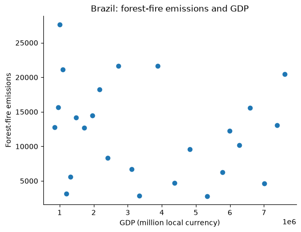
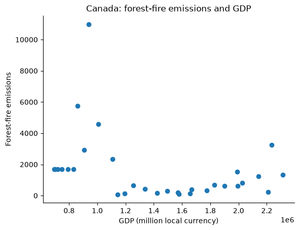
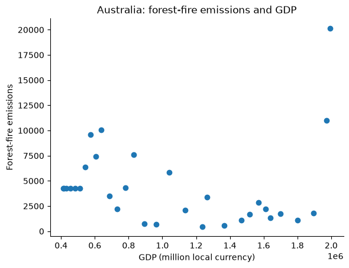

# Forest-fire Emissions and GDP

## Introduction

This project examines the relationship between annual forest-fire emissions
and GDP in Brazil, Canada, and Australia using data from 1990–2020. Each country
is analyzed separately because GDP is reported in millions of local currency.
The fire measure is the `Forest fires` emissions column, rather than fire counts
or burned area.

## Results

Each point represents one year with both measurements available. Pearson's
correlation coefficient describes the linear association within each country.

| Country | Available years | Number of years | Pearson's r |
| --- | --- | --- | --- |
| Brazil | 1996–2020 | 25 | −0.189 |
| Canada | 1990–2020 | 31 | −0.349 |
| Australia | 1990–2020 | 31 | 0.006 |

Brazil shows a weak negative association, and Canada shows a modest negative
association. Australia has almost no overall linear association, despite high
fire emissions in 2019 and 2020. Time trends and extreme fire years may affect
these correlations, so they do not establish causation; GDP is used as supplied,
without an additional inflation adjustment.





## Methods

`get_fire_gdp_year_data` filters both datasets by country and matches records by
year. Years with an empty fire or GDP value, or no matching GDP year, are
excluded; zero values are retained. GDP is plotted on the x-axis and forest-fire
emissions on the y-axis using `src/scatter.py`.

Save the [emissions dataset](https://docs.google.com/uc?export=download&id=1AsXP_OGs1O_TDeXiZjk3fYV1SrG4vwXF)
as `data/Agrofood_co2_emission.csv` and the
[GDP dataset](https://docs.google.com/uc?export=download&id=19YEPysdnK7VCXuAe9Og9pwYkNT5CbQzr)
as `data/IMF_GDP.csv`. 

Generate the paired data, correlations, and plots:

```bash
mkdir -p results
PYTHONPATH=src python - <<'PY'
from pathlib import Path

import numpy as np

from fire_gdp import get_fire_gdp_year_data

for country in ['Brazil', 'Canada', 'Australia']:
    rows = get_fire_gdp_year_data(
        'data/Agrofood_co2_emission.csv', 'data/IMF_GDP.csv', country,
    )
    pairs = [(gdp, fires) for year, fires, gdp in rows]
    Path(f'data/{country}_fire_gdp.tsv').write_text(
        ''.join(f'{gdp}\t{fires}\n' for gdp, fires in pairs)
    )
    correlation = np.corrcoef(np.array(pairs).T)[0, 1]
    print(f'{country}: n={len(rows)}, r={correlation:.3f}')
PY

for country in Brazil Canada Australia; do
    python src/scatter.py "data/${country}_fire_gdp.tsv" \
        "results/${country}.png" "$country: forest-fire emissions and GDP" \
        "GDP (million local currency)" "Forest-fire emissions"
done
```

## Tests

GitHub Actions also runs both suites on pushes
and pull requests.

```bash
PYTHONPATH=src python -m unittest discover -s test/unit -p 'test_*.py' -v
for test_script in test/func/test_*.sh; do
    PYTHON=python bash "$test_script" || exit 1
done
```
